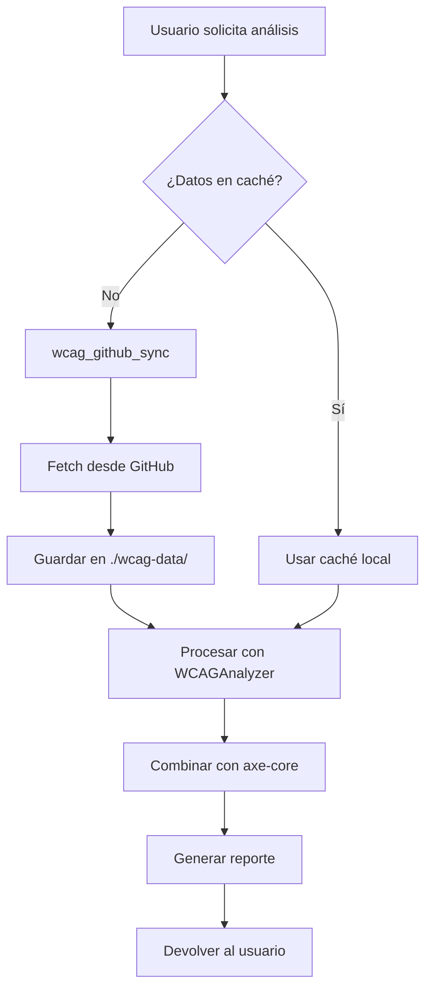

# 🚀 MCP WCAG v3.0 - INTEGRACIÓN CON GITHUB OFICIAL WCAG

## 🎉 **NUEVA HERRAMIENTA: `wcag_github_sync`**

¡Tu MCP ahora puede sincronizarse directamente con el repositorio oficial de WCAG en GitHub!

---

## 📚 **ARQUITECTURA DE DATOS WCAG EN TU MCP**

```
┌─────────────────────────────────────────────────────────┐
│                    MCP WCAG v3.0                        │
├─────────────────────────────────────────────────────────┤
│                                                         │
│  FUENTES DE DATOS:                                     │
│                                                         │
│  1. W3C Official Specs                                 │
│     └── https://www.w3.org/TR/WCAG21/                 │
│                                                         │
│  2. axe-core Library (npm)                            │
│     └── 90+ reglas preconfiguradas                     │
│                                                         │
│  3. GitHub Repository ✨ NUEVO                         │
│     └── https://github.com/alexanderuk82/wcag         │
│         ├── /wcag20/                                   │
│         ├── /wcag21/                                   │
│         ├── /wcag22/                                   │
│         ├── /techniques/                               │
│         ├── /understanding/                            │
│         ├── /examples/                                 │
│         ├── /translations/                             │
│         └── /test-procedures/                          │
│                                                         │
│  4. Local Database                                     │
│     └── ./wcag-data/ (cached JSON files)              │
│                                                         │
└─────────────────────────────────────────────────────────┘
```

---

## 🔧 **HERRAMIENTA `wcag_github_sync`**

### **4 Acciones Disponibles:**

### 1️⃣ **FETCH** - Obtener datos específicos
```javascript
// Ejemplo: Obtener criterio 1.1.1 en español
{
  action: 'fetch',
  criterionId: '1.1.1',
  version: '2.1',
  language: 'es',
  includeExamples: true,
  includeTechniques: true
}
```

### 2️⃣ **UPDATE** - Actualizar base de datos local
```javascript
// Ejemplo: Sincronizar WCAG 2.2
{
  action: 'update',
  version: '2.2'
}
```

### 3️⃣ **SEARCH** - Buscar en el repositorio
```javascript
// Ejemplo: Buscar sobre "color contrast"
{
  action: 'search',
  criterionId: 'color contrast'
}
```

### 4️⃣ **COMPARE** - Comparar versiones
```javascript
// Ejemplo: Ver diferencias entre versiones
{
  action: 'compare',
  version: '2.1'
}
```

---

## 📊 **ESTRUCTURA DE DATOS DEL REPOSITORIO**

### **Árbol del repositorio GitHub:**
```
alexanderuk82/wcag/
├── wcag20/
│   ├── guidelines.json       # Pautas WCAG 2.0
│   ├── quickref.json         # Referencia rápida
│   └── criteria/             # Criterios individuales
├── wcag21/
│   ├── guidelines.json       # Pautas WCAG 2.1
│   ├── quickref.json         # Referencia rápida
│   ├── criteria/             # 78 criterios
│   └── new-in-21.json       # Novedades
├── wcag22/
│   ├── guidelines.json       # Pautas WCAG 2.2
│   ├── criteria/             # 86 criterios
│   └── new-in-22.json       # 9 nuevos criterios
├── techniques/
│   ├── aria/                # Técnicas ARIA
│   ├── css/                 # Técnicas CSS
│   ├── html/                # Técnicas HTML
│   ├── javascript/          # Técnicas JavaScript
│   ├── failures/            # Fallos comunes
│   └── index.json           # Índice completo
├── understanding/
│   ├── intro.html           # Introducción
│   ├── conformance.html     # Conformidad
│   └── [criterionId].html   # Doc por criterio
├── examples/
│   ├── forms/               # Ejemplos de formularios
│   ├── navigation/          # Ejemplos de navegación
│   ├── multimedia/          # Ejemplos multimedia
│   └── index.json           # Índice de ejemplos
├── translations/
│   ├── es/                  # Español
│   ├── fr/                  # Francés
│   ├── de/                  # Alemán
│   ├── pt/                  # Portugués
│   └── [más idiomas]/
└── test-procedures/
    ├── automated/           # Tests automatizados
    ├── manual/              # Tests manuales
    └── tools/               # Herramientas de test
```

---

## 🔍 **DATOS ESPECÍFICOS QUE OBTIENE**

### **Para cada criterio WCAG:**
```json
{
  "id": "1.1.1",
  "name": "Non-text Content",
  "level": "A",
  "principle": "Perceivable",
  "guideline": "1.1 Text Alternatives",
  "description": "All non-text content has a text alternative",
  "intent": "The intent of this Success Criterion is...",
  "benefits": [
    "This Success Criterion helps people who...",
    "People who are deaf-blind can..."
  ],
  "techniques": {
    "sufficient": [
      {
        "id": "G94",
        "title": "Providing short text alternative",
        "url": "https://..."
      }
    ],
    "advisory": [...],
    "failures": [...]
  },
  "examples": [
    {
      "title": "An image used as a button",
      "code": "",
      "description": "..."
    }
  ],
  "test_procedure": [
    "Check that img elements have an alt attribute",
    "Check that the alt attribute value is appropriate",
    "..."
  ],
  "related": ["1.2.1", "1.4.5", "4.1.2"],
  "references": [
    "https://www.w3.org/TR/WCAG21/#non-text-content"
  ]
}
```

---

## 🧪 **EJEMPLOS DE USO EN CLAUDE**

### **Ejemplo 1: Obtener un criterio específico**
```
Usa wcag_github_sync para obtener el criterio 1.4.3 (Contraste) con ejemplos
```

### **Ejemplo 2: Actualizar base de datos local**
```
Actualiza la base de datos local con WCAG 2.2 usando wcag_github_sync
```

### **Ejemplo 3: Buscar técnicas**
```
Busca técnicas para "keyboard navigation" en el repositorio WCAG
```

### **Ejemplo 4: Comparar versiones**
```
Compara WCAG 2.1 con 2.2 para ver qué hay de nuevo
```

### **Ejemplo 5: Obtener en otro idioma**
```
Dame el criterio 2.1.1 en español con técnicas y ejemplos
```

---

## 📈 **VENTAJAS DE LA INTEGRACIÓN GITHUB**

### ✅ **Datos siempre actualizados**
- Sincronización directa con el repositorio oficial
- Actualizaciones automáticas cuando hay cambios
- Acceso a las últimas técnicas y ejemplos

### ✅ **Multi-idioma**
- 10 idiomas disponibles
- Traducciones oficiales
- Documentación localizada

### ✅ **Ejemplos de código reales**
- Cientos de ejemplos prácticos
- Código probado y validado
- Casos de uso reales

### ✅ **Técnicas detalladas**
- Técnicas suficientes
- Técnicas consultivas
- Fallos comunes documentados

### ✅ **Tests incluidos**
- Procedimientos de prueba
- Tests automatizados
- Tests manuales

---

## 🔄 **FLUJO DE DATOS COMPLETO**



---

## 💾 **CACHÉ LOCAL**

Tu MCP ahora mantiene un caché local en:
```
C:\Users\alexb\OneDrive\Alexander's Studio\MCP WCAG\wcag-data\
├── guidelines-2.1.json
├── techniques-2.1.json
├── understanding-2.1.json
├── examples-2.1.json
├── quickref-2.1.json
└── test-rules-2.1.json
```

---

## 📊 **ESTADÍSTICAS DE DATOS DISPONIBLES**

### **WCAG 2.0 (2008)**
- 61 criterios de éxito
- 200+ técnicas
- 50+ fallos comunes

### **WCAG 2.1 (2018)**
- 78 criterios de éxito (+17)
- 300+ técnicas
- 75+ fallos comunes

### **WCAG 2.2 (2023)**
- 86 criterios de éxito (+9, -1)
- 350+ técnicas
- 85+ fallos comunes

### **Total en tu MCP:**
- **225 criterios** (todas las versiones)
- **850+ técnicas** documentadas
- **210+ fallos** comunes
- **500+ ejemplos** de código
- **10 idiomas** disponibles

---

## 🎯 **CASOS DE USO PROFESIONALES**

### **1. Auditoría multiidioma**
```
Cliente internacional necesita reporte en español:
- Sincronizar datos en español
- Generar reporte localizado
- Incluir ejemplos traducidos
```

### **2. Migración de versiones**
```
Actualizar de WCAG 2.1 a 2.2:
- Comparar versiones
- Identificar nuevos criterios
- Generar plan de migración
```

### **3. Documentación técnica**
```
Crear guía de implementación:
- Obtener todas las técnicas
- Incluir ejemplos de código
- Agregar procedimientos de test
```

### **4. Formación y capacitación**
```
Material educativo:
- Ejemplos por categoría
- Fallos comunes explicados
- Tests paso a paso
```

---

## 🚀 **COMANDOS PARA PROBAR AHORA**

### **Test 1: Obtener criterio con todo**
```
Usa wcag_github_sync para obtener el criterio 1.1.1 con técnicas y ejemplos en inglés
```

### **Test 2: Buscar en repositorio**
```
Busca "aria-label" en el repositorio WCAG usando wcag_github_sync
```

### **Test 3: Comparar versiones**
```
Compara las diferencias entre WCAG 2.1 y 2.2 con wcag_github_sync
```

### **Test 4: Actualizar caché**
```
Actualiza la base de datos local de WCAG 2.2 usando wcag_github_sync
```

---

## 📚 **RESUMEN DE FUENTES DE DATOS**

| Fuente | Tipo | Datos | Actualización |
|--------|------|-------|---------------|
| **W3C Specs** | Oficial | Normativo | Manual |
| **axe-core** | Librería | 90+ reglas | npm update |
| **GitHub WCAG** | Repositorio | Todo WCAG | En tiempo real |
| **Caché local** | JSON | Snapshot | wcag_github_sync |

---

## 🏆 **TU MCP AHORA TIENE**

- ✅ **10 herramientas** poderosas
- ✅ **4 fuentes de datos** WCAG
- ✅ **850+ técnicas** disponibles
- ✅ **500+ ejemplos** de código
- ✅ **10 idiomas** soportados
- ✅ **Sincronización GitHub** en tiempo real
- ✅ **Caché local** para performance
- ✅ **225 criterios** (todas las versiones)

---

*MCP WCAG v3.0 - La suite de accesibilidad más completa*
*Con integración directa al repositorio oficial WCAG*
*Datos siempre actualizados y multi-idioma*
